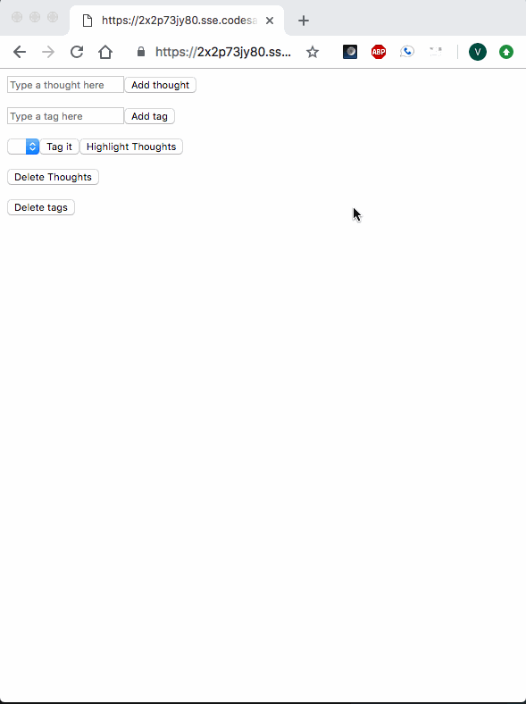

# Six Week Version
1. What is impossible to do manually?
   - Access the web app--time to deploy!
2. What is the next most annoying task to do manually?
   - Save thought boards
3. What is the next most annoying task to do manually?
   - Stay patient with the barebones UI and UX

# Four Week Version
1. What is the next most annoying task to do manually?
    - Keeping track of old categories after assigning new categories (i.e. user should be able to add "subcategories")
2. What is the next most annoying task to do manually?
    - Process/analyze thought groups from a linear list
## Core Functionality
User can add thoughts to the screen, assign categories to them, and view them in groups by category

# Two Week Version

1. What is the task that is impossible to do manually?
    - This app doesn't pass this ask
2. What is the task that is annoying to do manually?
    - Write down and then iteratively categorize and group your thoughts

## Core Functionality

Allow user to write down and then iteratively categorize and group their thoughts.

### User can add thoughts

### User can add categories

### User can categorize thoughts

### User can re-categorize thoughts

